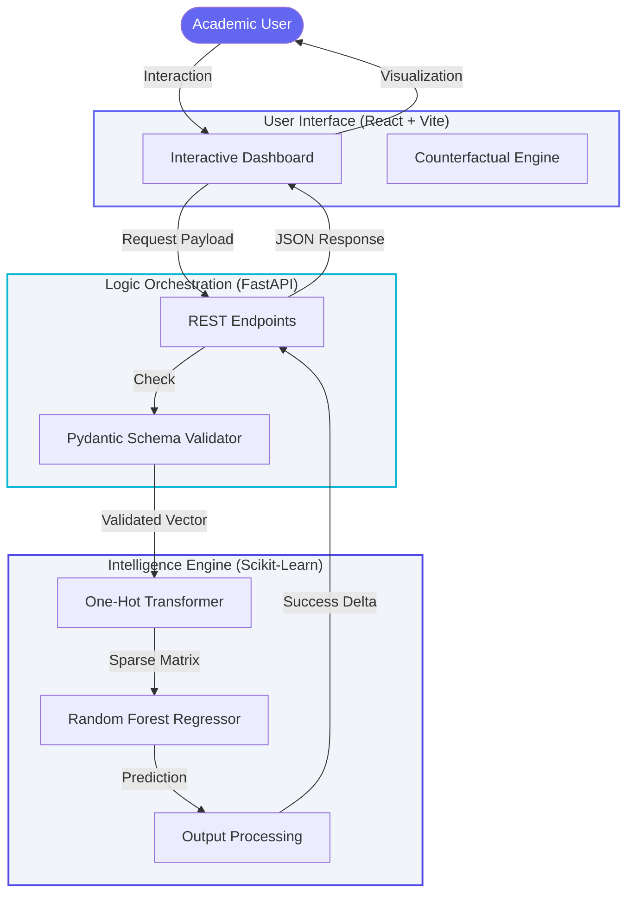
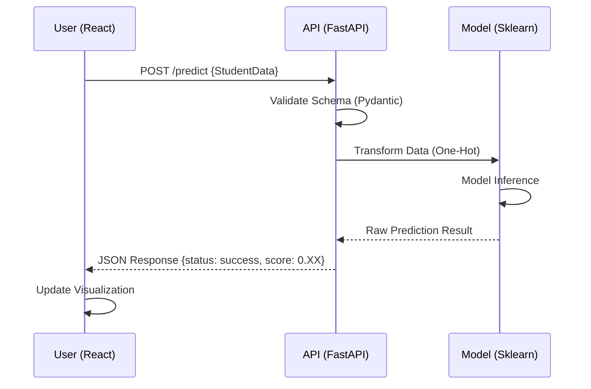

# System Architecture

Nexus ML is engineered as a decoupled academic intelligence portal, optimized for low-latency inference and high-dimensional model execution.

## High-Fidelity Ecosystem

The system follows a modern three-tier architecture, ensuring that the heavy lifting of machine learning prediction is completely isolated from the user interface.

---

## Technical Deep Dive

### 1. Data Transformation Strategy
Nexus ML utilizes a **Sparse Matrix Transformation** strategy. Categorical student features (e.g., *Sex*, *High School Type*) are dynamically expanded into a one-hot encoded vector at runtime. This ensures that the Random Forest model processes the exact feature geometry it was trained on, minimizing "out-of-distribution" errors.

### 2. Counterfactual Inference
The "What-If" engine allows users to mutate behavioral variables (like *Attendance* or *Weekly Study Hours*) while keeping demographic variables frozen. This isolates the mathematical impact of specific changes on the final academic trajectory.

---

## Sequence Execution
The following sequence demonstrates the lifecycle of a single prediction request.

