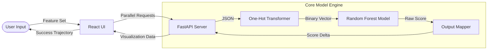

# System Architecture

Nexus ML operates as a decoupled academic intelligence portal. The architecture is designed to handle high-dimensional feature vectors with minimal inference overhead.

## Ecosystem Overview

| Layer | Component | Description |
| :--- | :--- | :--- |
| **User Interface** | [React](https://reactjs.org/) | Multi-state dashboard with parallel "What-If" evaluation logic. |
| **Logic Engine** | [FastAPI](https://fastapi.tiangolo.com/) | RESTful orchestration layer for real-time model interaction. |
| **Intelligence** | [Scikit-Learn](https://scikit-learn.org/) | Serialization and execution of the Random Forest Regressor. |

---

## Execution Pipeline

The flowchart below demonstrates the trajectory calculation path from input to insight.

---

## Engineering Deep Dive

### High-Fidelity Data Transformation
To ensure model consistency, the system uses a shared `expected_features.json` schema. At runtime, categorical inputs are dynamically expanded into a sparse matrix, ensuring that a "Private" high school input correctly activates the specific weights trained for that variable.

### Paradoxical Prediction Logic
The "What-If" engine performs what we call *Counterfactual Inference*. It keeps the student's base profile frozen while selectively mutating behavioral variables (e.g., Attendance) to observe the score's sensitivity to those specific changes.
