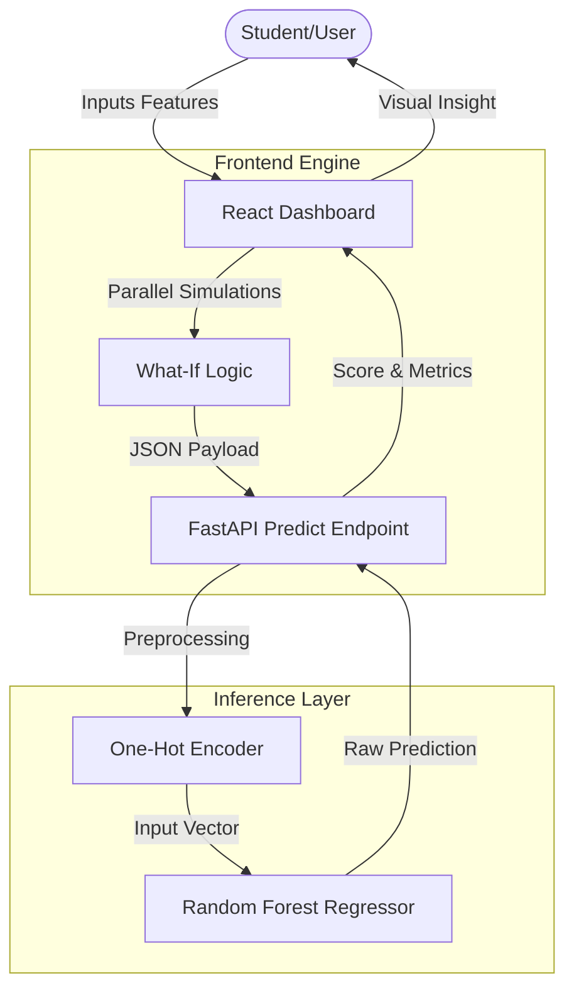

# System Architecture

Nexus ML is built as a de-coupled full-stack application with a specialized machine learning pipeline. This architecture ensures high availability, scalability, and modular maintenance.

## Technical Stack

| Layer | Technology | Role |
| :--- | :--- | :--- |
| **Frontend** | React + Vite | Interactive UI, "What-If" Analysis, Real-time Visualizations. |
| **Backend** | FastAPI (Python) | High-performance REST API, Logic handling, Pydantic validation. |
| **ML Engine** | Scikit-Learn | Training, Feature Engineering, Inference (Random Forest). |
| **Infrastructure** | MkDocs Material | Static site generation for technical documentation. |

---

## High-Level System Flow

The following diagram illustrates how user input travels from the React Dashboard to the ML Model and back as an actionable insight.

---

## Architectural Deep Dive

### 1. The Preprocessing Pipeline
Unlike simple models, our pipeline performs **dynamic one-hot encoding** at runtime.
- **Challenge**: Categorical variations (e.g., `Scholarship_100%`) must match the exact binary format used in training.
- **Solution**: The `api/main.py` script loads `expected_features.json` and maps incoming JSON strings into a high-dimensional vector space using zero-matrix initialization and prefix matching.

### 2. Multi-Model Winner Selection
During training, the system evaluates:
1. **Linear Regression** (Baseline)
2. **Random Forest Regressor** (Ensemble)
3. **XGBoost** (Gradient Boosting)

The `train.py` script automatically exports the model with the highest R2 score to `model.pkl`.

### 3. Frontend Parallel Inference
The React application triggers multiple requests using `Promise.all` to fetch predictions for:
- Current state (Actual inputs)
- Improved attendance scenario
- Increased study hours scenario

This allows the UI to display a "Trajectory Gap" – helping students visualize the impact of behavioral changes.
