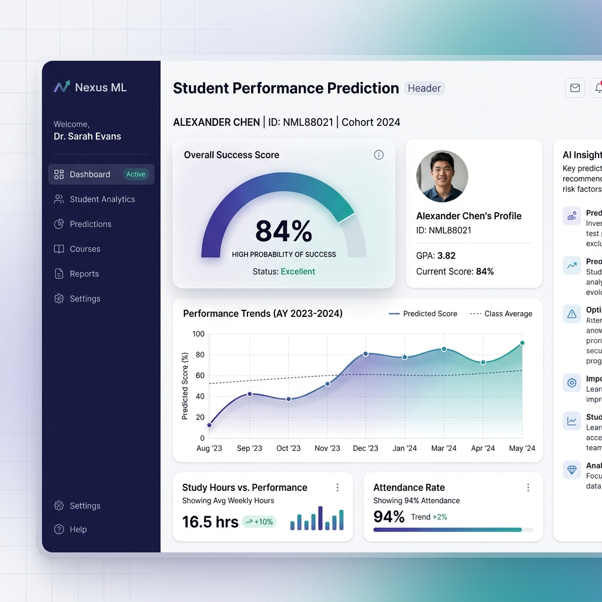

    

        <h1>Nexus ML</h1>
        
The high-performance intelligence engine for academic success. Predict trajectories, quantify effort, and engineer student outcomes with precision AI.

        

            <a href="runbook/" class="aih-btn aih-btn-primary">Explore Platform</a>
            <a href="https://github.com/monkey9-Cyber-cat-Spidy/Student-Performance-Prediction" class="aih-btn aih-btn-secondary">View Source</a>
        

    

    

## Intelligence Capabilities

    
🎯

    <h3>Predictive Accuracy</h3>
    
Utilize optimized Random Forest Regressors to forecast final academic scores with high-dimensional feature sensitivity.

    
⚡

    <h3>Counterfactual Logic</h3>
    
Mathematically simulate behavioral changes. Quantify how specific lifestyle adjustments impact academic success trajectories.

    
🔓

    <h3>Glass-Box Metrics</h3>
    
No hidden variables. Access full feature importance rankings and residual benchmarks directly through the dashboard.

---

## Technical Infrastructure

Designed for low-latency inference and scalable student data analysis:

- **UI Orchestration**: Real-time interactive dashboard powered by **React** and **Vite**.
- **Inference Pipeline**: Distributed **FastAPI** backend designed for rapid model execution.
- **Data Engineering**: Robust feature scaling and one-hot encoding optimized for **Scikit-Learn**.

---

> [!IMPORTANT]
> **Data Privacy**: All student metrics are handled with strict local serialization. Nexus ML is built for localized institution deployments to ensure data sovereignty.
